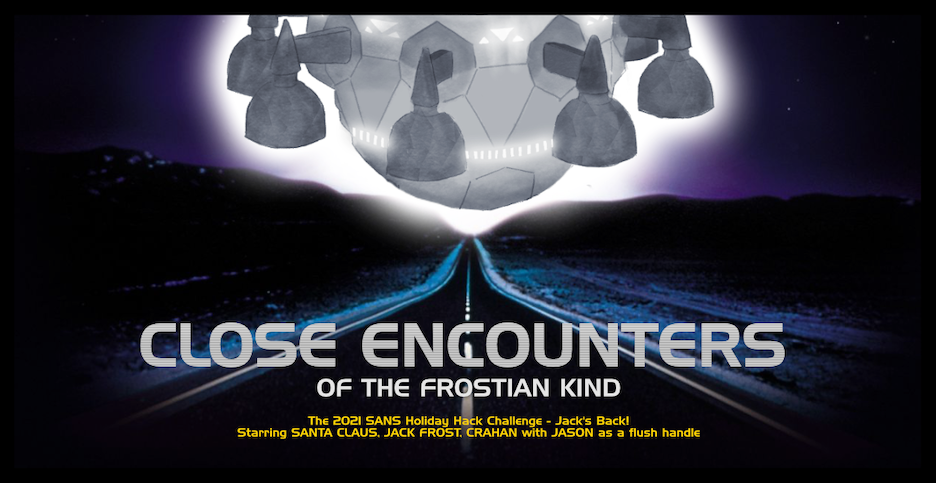
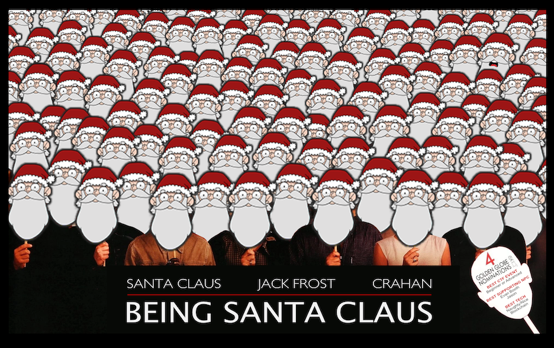
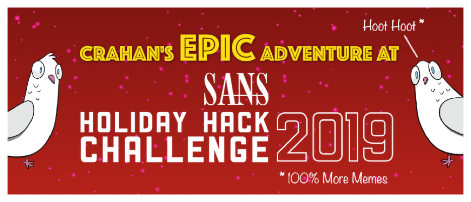

## SANS Holiday Hack Challenge Write-Ups

## Random

> Folks that throw dirt on you aren't always trying to hurt you, and folks that pull you out of a jam aren't always trying to help you. But the main point is when you're up to your nose in shit, keep your mouth shut.
>
> -- <cite>Jack Beauregard</cite>

## Socials

- [Mastodon](https://mastodon.social/@crahan)
- [Twitter](https://www.twitter.com/crahan)
- [Instagram](https://instagram.com/crahan)
- [Github](https://github.com/crahan)
- [Pinboard](https://pinboard.in/u:crahan)
